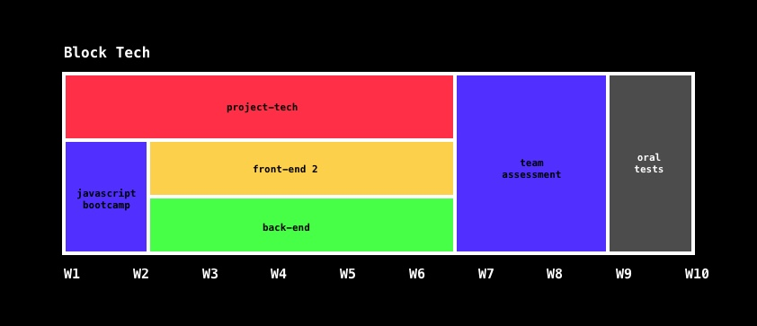

# ![Project Tech - Course 2018-2019][banner]

## Table of Contents

*   [Synopsis](#synopsis)
*   [Description](#description)
*   [Communication](#communication)
*   [Goals](#goals)
*   [Grade](#grade)
*   [Resources](/resources.md)
*   [Conduct](#conduct)
*   [License](#license)

## Synopsis

Project Tech is given at [**@CMDA**][cmda] in 2019 between
4 February and 20 June.

*   **Course**: Project Tech
*   **Coordinator**: [Anne Marleen Olthof][amgit]
*   **Lecturers**:
    [Danny de Vries][dangit] ([**@dandevri**][danweb]) (*tech-1* / *tech-2*) and
    [Anne Marleen Olthof][amgit] ([**@annemarleen**][amweb])
    (*tech3*)
*   **SIS**: Project Tech
*   **Credit**: 5 ECTS
*   **Academic year**: 2018-2019
*   **Period**: Quarter 3 (spring)
*   **Programme**: Communication and Multimedia Design (full time bachelor)
*   **Language**: Dutch instructions and English resources
*   **Entry requirements**: N/A

## Description

In **Project Tech** you'll build a dynamic prototype of a web application. In different roles you take a well-argued position on, among other things, the privacy and security aspects of the application. You'll also learn to *navigate the command line*, version control with *Git & GitHub* and make sure *code style* is consistent.

## Communication

*   [GitHub][gh] — Main source of information, assignments, important dates,
    and more
*   [Examples][examples] — Example code from slides
*   [Slack][slack] — General chatter and Q&A
*   [Moodle][moodle] — Schedulers

If you have questions:

*   Read the manual for the technology in question
    ([Git](https://git-scm.com/docs),
    [GitHub](https://guides.github.com),
    [EditorConfig](https://editorconfig.org/),
    [ESLint](https://eslint.org/),
    [Stylelint](https://github.com/stylelint/stylelint))
*   [Search StackOverflow][stackoverflow]
*   [Use a search engine like Startpage][startpage]
*   [Ask questions on Slack][slack]
*   [Contact a lecturer][synopsis]

## Goals

#### Main goals

The 2 main goals in this course are that you’re able to:

*   Collaborate (formal and informal) with other developers
*   Adhere to standards; code style, documentation

#### Sub goals

In practice you’ll learn to:

**Tech:**

* 
    Understand Git principles ([**week 1**][w1])
*  
    Understand the GitHub flow ([**week 1**][w1])
* 
    Write docs in Markdown ([**week 1**][w2])
* 
    Navigate the command-line ([**week 2**][w2])
* 
    Customize your local machine ([**week 2**][w2])
* 
    Use Editors, Extensions and Configs  ([**week 4**][w4])
* 
    Use linters like ESLint and Stylelint ([**week 4**][w4])
* 
    Debugging your code ([**week 5**][w5])
* 
    Collaborate on GitHub ([**week 5+**][w5])
* 
    Doing Code Reviews ([**week 5+**][w5])

**Research**
* 
    Competitive analyses ([**week 1**][w1])
*  
    Branding research ([**week 1**][w1])
*  
    Writing Job Stories ([**week 2**][w2])
*  
    Requirement List ([**week 4**][w4])
*  
    Usability Testing ([**week 4**][w4])
*  
    Quality reviews ([**week 5+**][w5])
*  
    Peer Reviews ([**week 5+**][w5])

The below table breaks down the general time needed per week.

| Week | Effort | Topics                      | Activities                         |
| ---- | -----: | ----------------------------| ----------------                   |
| 0    |  NaN   | getting started             | [getting started][gs]              |
| 1    |  9:20h | git & github, competitive   | [lab][w1lab], [assignments][w1a]   |
| 2    |  9:20h | cli, job stories            | [lab][w2lab], [assignments][w2a]   |
| 3    |  9:20h | coaching sessions           | [lab][w3lab], coaching             |
| 4    |  9:20h | configs, requirements       | [lab][w4lab], [assignments][w4a]   |
| 5    |  9:20h | collaboration, reviews      | [lab][w5lab], [assignments][w5a]   |
| 6    |  9:20h | coaching sessions           | [lab][w6lab], coaching             |
| 7    |  9:20h | prototype (coaching)        | [lab][w7lab], work on prototype    |
| 8    |  9:20h | prototype (coaching)        | [lab][w8lab], work on prototype    |
| 9    |  NaN   | oral test                   | [oral test][grading]               |

    
Schedule

    

## Grade

| Task                                |   Weight |
| ----------------------------------  | -------: |
| [Prototype][grading] (oral test)  |      100% |
| **Total**                           | **100%** |

## Programme

This course is given at [Communication and Multimedia Design][bachelor], a
design bachelor focused on interactive digital products and services.  CMD is
part of the [Faculty of Digital Media and Creative Industries][faculty] at the
[Amsterdam University of Applied Sciences][university].

## Conduct

This course has a [Code of Conduct][coc].  Anyone interacting with this
repository, organisation, or community is bound by it.

Staff and students of the Amsterdam University of Applied Sciences (Hogeschool
van Amsterdam) are additionally bound by the [Regulation Undesirable
Conduct][ruc] ([Regeling Ongewenst Gedrag][rog]).

## License

Unless stated otherwise, code is [MIT][] © [Danny de Vries][author]
docs and images are [CC-BY-4.0][].

[banner]: https://cmda-bt.github.io/pt-course-18-19/assets/banner.svg
[cmda]: https://github.com/cmda
[dangit]: https://github.com/dandevri
[danweb]: https://github.com/dandevri
[amgit]: https://github.com/annemarleen
[amweb]: https://github.com/annemarleen

[gh]: https://github.com/cmda-be/course-18-19
[examples]: /examples
[slack]: https://cmda-tech.slack.com/
[moodle]: https://moodle.cmd.hva.nl/course/view.php?id=431
[examples]: examples
[stackoverflow]: https://stackoverflow.com
[startpage]: https://www.startpage.com/
[synopsis]: #synopsis
[gs]: getting-started.md

[w1]: week-1.md
[w2]: week-2.md
[w3]: week-3.md
[w4]: week-4.md
[w5]: week-5.md

[w1lab]: week-1.md
[w2lab]: week-2.md
[w3lab]: week-3.md
[w4lab]: week-4.md
[w5lab]: week-5.md
[w6lab]: week-6.md
[w7lab]: week-7.md
[w8lab]: week-8.md

[w1a]: week-1#assignments.md
[w2a]: week-2#assignments.md
[w3a]: week-3#assignments.md
[w4a]: week-4#assignments.md
[w5a]: week-5#assignments.md
[w6a]: week-6#assignments.md
[w7a]: week-7#assignments.md
[w8a]: week-8#assignments.md

[grading]: grading.md
[bachelor]: https://www.cmd-amsterdam.nl/english/
[faculty]: https://www.amsterdamuas.com/faculty/fdmci/faculty-of-digital-media-and-creative-industries.html
[university]: https://www.amsterdamuas.com
[coc]: code-of-conduct.md
[ruc]: https://www.amsterdamuas.com/practical-matters/algemeen/hva-breed/juridische-zaken/legal-affairs/regulation-undesirable-conduct/regulation-undesirable-conduct.html#anker-3-complaints-authority
[rog]: https://www.hva.nl/praktisch/algemeen/hva-breed/juridische-zaken/loket-beroep-bezwaar-en-klacht/regeling-ongewenst-gedrag/regeling-ongewenst-gedrag.html?origin=gbS4rg%2FDTZuxQ6lGVF%2BN1A
[author]: https://dandevri.es
[mit]: license.md#code
[cc-by-4.0]: license.md#documentation-and-images